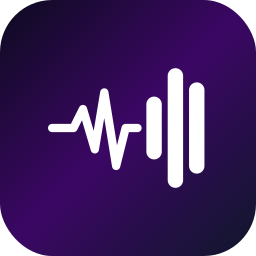
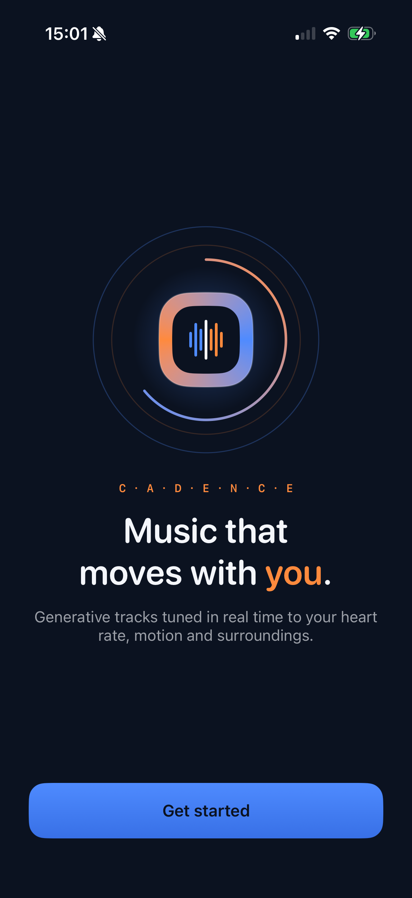
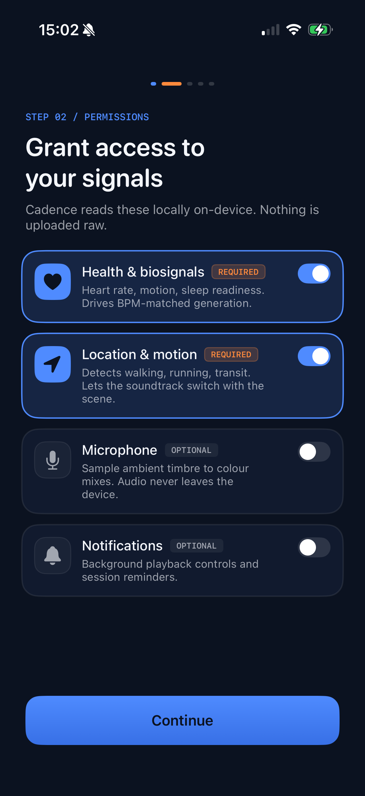
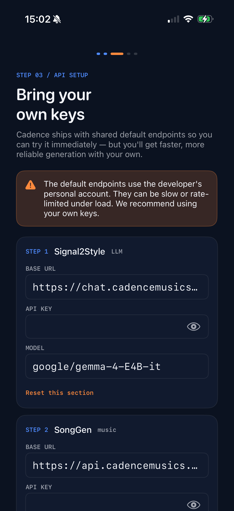
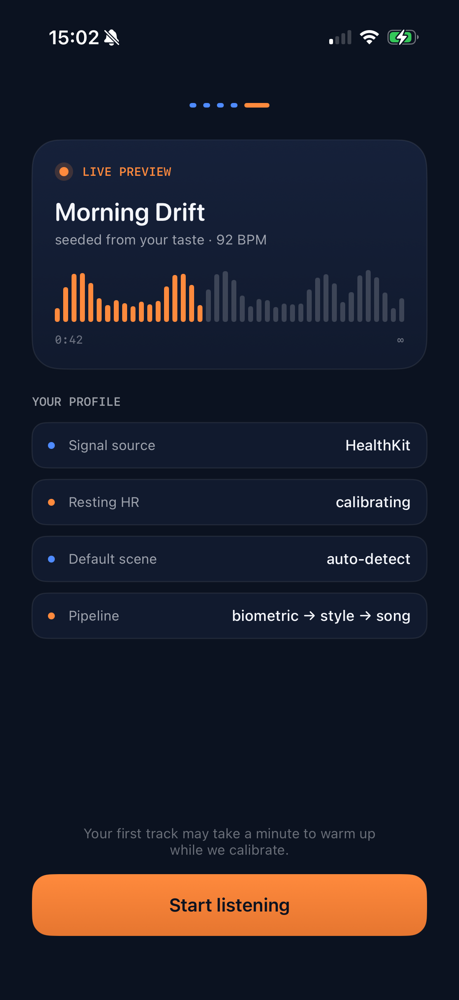
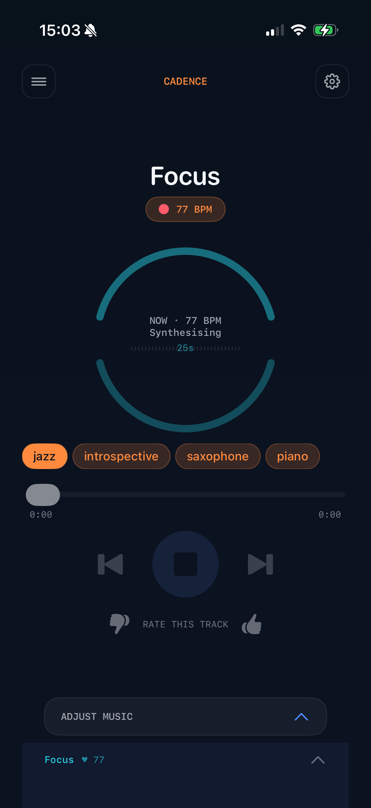
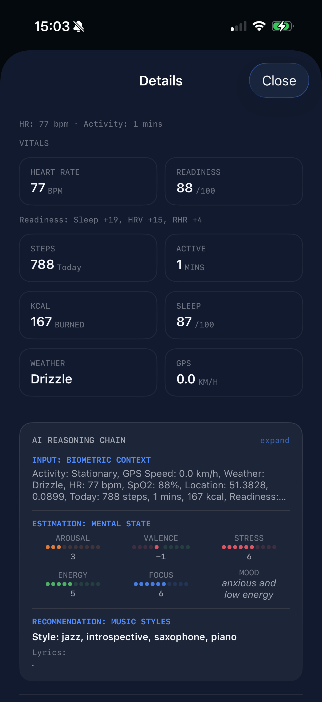
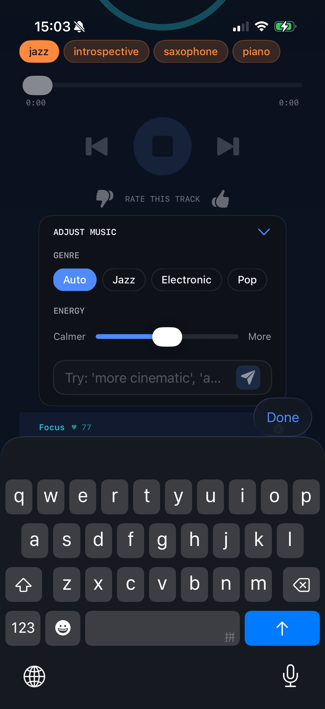
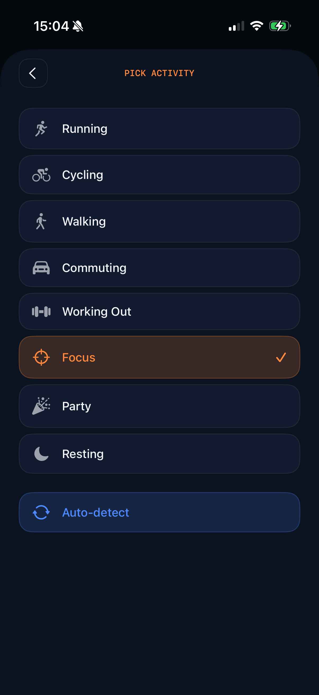

<div align="center">



# Cadence AI Music — iOS

### Music that moves with you

**English** · [简体中文](README.zh-CN.md)

[Android](https://github.com/wtgme/cadence) · **iOS**

[](https://www.apple.com/ios/)
[](https://swift.org)
[](https://developer.apple.com/xcode/swiftui/)

**Cadence** continuously reads your physiological state and generates personalised instrumental music in real time — grounded in the *iso-principle*: matching music to your current state before gradually steering it toward a desired emotional target.

</div>

This is the iOS port of [`wtgme/cadence`](https://github.com/wtgme/cadence) (Android). It targets feature parity with the Android version, swapping the platform-specific layers (Health Connect → HealthKit, Compose → SwiftUI, ExoPlayer → AVPlayer, etc.) while keeping the same domain logic, prompts, and generation pipeline.

---

## Screenshots

<table>
  <tr>
    <td align="center"><br/><sub><b>Welcome</b><br/>Onboarding entry point</sub></td>
    <td align="center"><br/><sub><b>Permissions</b><br/>HealthKit &amp; Location</sub></td>
    <td align="center"><br/><sub><b>API Setup</b><br/>Bring your own keys</sub></td>
    <td align="center"><br/><sub><b>Ready</b><br/>Start your first session</sub></td>
  </tr>
  <tr>
    <td align="center"><br/><sub><b>Scene Detection</b><br/>Auto-detected activity</sub></td>
    <td align="center"><br/><sub><b>AI Reasoning</b><br/>Full inference chain</sub></td>
    <td align="center"><br/><sub><b>Adjust Music</b><br/>Genre, energy, free-text prompt</sub></td>
    <td align="center"><br/><sub><b>Adjust Scene</b><br/>Manual scene override</sub></td>
  </tr>
</table>

---

## Scientific Background

Music is among the most effective strategies for everyday emotion regulation. The **iso-principle** — matching music to a listener's psychophysiological state before shifting it toward a target — has controlled experimental support, producing significantly higher positive affect than passive listening. Neurobiologically, music modulates cortisol, autonomic arousal, and reward circuitry.

These effects depend critically on *fit* between musical properties and real-time listener state. No existing consumer system achieves this automatically. Cadence is a functional prototype addressing this gap.

---

## Two-Step AI Pipeline

```
┌─────────────────────────────────────────────────────────────┐
│                      SENSOR LAYER                           │
│  Heart Rate · HRV · SpO2 · Sleep · Steps · GPS · Weather    │
└────────────────────────┬────────────────────────────────────┘
                         │
                         ▼
┌─────────────────────────────────────────────────────────────┐
│               STEP 1 — Context Translation                  │
│  LLM — any OpenAI-compatible chat endpoint                  │
│  Biometric context → Mental state estimation                │
│  (arousal · valence · stress · energy · focus)              │
│  → Song parameters (genre tags · BPM · mood · intensity)    │
└────────────────────────┬────────────────────────────────────┘
                         │
                         ▼
┌─────────────────────────────────────────────────────────────┐
│               STEP 2 — Music Generation                     │
│  Text-to-music model (MiniMax, SongGeneration, etc.)        │
│  Song parameters → Instrumental MP3                         │
└────────────────────────┬────────────────────────────────────┘
                         │
                         ▼
┌─────────────────────────────────────────────────────────────┐
│              PRE-BUFFERED PLAYBACK                          │
│  2-item buffer · seamless transitions                       │
│  Reprimed on scene change or HR drift ±15 bpm               │
└─────────────────────────────────────────────────────────────┘
```

All biometric data is **processed on-device**. Only anonymised contextual summaries are transmitted for music generation.

---

## Scene Detection

Cadence classifies your activity context from sensor fusion and uses it to shape generation:

| Scene | Trigger | Musical intent |
|---|---|---|
| Running | Speed > 8 km/h or HR > 135 bpm | High-energy, tempo-matched |
| Walking | Speed 3–8 km/h | Mid-tempo, steady |
| Commuting | Speed > 25 km/h | Alert, low-distraction |
| Working Out | Manual | Energetic, motivational |
| Focus | Manual | Minimal, concentration-supporting |
| Resting | Low movement / default | Slow, restorative, ambient |
| Party | Manual | Upbeat, social |

---

## Research Transparency

The app exposes its full reasoning chain in real time so users understand *why* a piece of music was generated:

- **Biometric input** — raw sensor readings with weather and location context
- **Mental state estimation** — scored dimensions: arousal, valence, stress, energy, focus, mood
- **Music recommendation** — selected style, genre tags, and lyric scaffold
- **Override & feedback** — users may adjust any parameter or rate tracks; a taste profile adapts over time

This design supports informed consent and user agency — principles central to responsible AI deployment in health contexts.

---

## Requirements

- iOS 16.0 or newer
- iPhone with **HealthKit** support (any iPhone 8 / SE 2 or newer)
- An Apple Developer account (free tier works for personal sideload; paid tier needed for App Store / TestFlight)
- A compatible wearable for live biometrics: Apple Watch, or any device that writes to the iOS Health app (Whoop, Oura, Garmin Connect, etc.)

---

## Setup

Cadence's two pipeline stages each call an HTTP endpoint, and both are configurable in-app via **API Settings** (gear icon → API SETTINGS). You can mix and match:

- **Step 1 — LLM** (biometrics → song style): any OpenAI-compatible chat endpoint — [OpenRouter](https://openrouter.ai/), a local Ollama / vLLM server, or the bundled `cadence-api` LLM endpoint.
- **Step 2 — Music generation**: a text-to-music endpoint such as [MiniMax Music](https://www.minimax.io/), a self-hosted [SongGeneration](https://github.com/tencent-ailab/SongGeneration) server, or the bundled `cadence-api` music endpoint.

### Self-hosted reference server (optional)

[**wtgme/cadence-api**](https://github.com/wtgme/cadence-api) packages both pipeline stages into a single FastAPI service: an OpenAI-compatible chat endpoint backed by your model of choice, plus a SongGeneration wrapper. Useful if you want full local control or a private GPU deployment. **It is not required** — any compatible third-party APIs work.

### Compile-time defaults

Defaults live in [`Cadence/BuildConfig.swift`](Cadence/BuildConfig.swift) and mirror Android's `local.properties`:

```swift
static let signal2StyleBaseUrl: String = "https://chat.cadencemusics.uk/v1"
static let signal2StyleApiKey: String  = "dummy"
static let signal2StyleModel: String   = "google/gemma-4-E4B-it"

static let songGenBaseUrl: String = "https://api.cadencemusics.uk/v1/music_generation"
static let songGenApiKey: String  = "dummy"
static let songGenModel: String   = "SongGeneration-v2-large"
```

User-supplied values via the **API Settings** screen are persisted in `UserDefaults` and override the BuildConfig defaults on every launch.

### Build

Open `Cadence.xcodeproj` in Xcode 15+ and pick a destination:

```bash
# debug build (simulator)
xcodebuild -scheme Cadence -destination 'generic/platform=iOS Simulator' -sdk iphonesimulator build

# unit tests
xcodebuild -scheme Cadence -destination 'platform=iOS Simulator,name=iPhone 17,OS=latest' -only-testing:CadenceTests test
```

### Capabilities required (Xcode → Signing & Capabilities)

- **HealthKit** — read access for heart rate, HRV, sleep, SpO2, steps, calories, distance, blood pressure, temperature, floors, exercise time. Free Apple ID supports this.
- **Background Modes** — Audio (for playback when the screen is off) and Location updates (so scene detection keeps running). Pre-set via `INFOPLIST_KEY_UIBackgroundModes` in `project.pbxproj`.

---

## Architecture

Clean Architecture · MVVM · Lightweight in-tree DI · Swift Concurrency + Combine · SwiftUI · AVPlayer

| Layer | What lives here |
|---|---|
| `Models/` | `Scene`, `SensorState`, `GeneratedSong`, `SongParams`, `MentalState` |
| `Domain/` | `SceneDetector`, `SceneStateMachine`, `PromptBuilder`, `ReadinessCalculator` |
| `Data/Api/` | `GenerationRepository`, `MusicRepository`, `SongGenerationBackend` |
| `Data/Sensor/` | HealthKit · CoreLocation · Open-Meteo · sleep integrations |
| `Data/…/` | Settings, Adjustment, Taste, Session, Onboarding repositories |
| `Audio/` | `MusicOrchestrator`, `AudioBufferManager`, `MusicPlayer` |
| `DI/` | In-tree `DIContainer` (Factory-style) |
| `UI/` | SwiftUI screens (Player, Settings, Debug, Onboarding) + ViewModels |

---

<div align="center">

*Built to match the Android version's behavior. See [`wtgme/cadence`](https://github.com/wtgme/cadence) for the Android source.*

</div>
